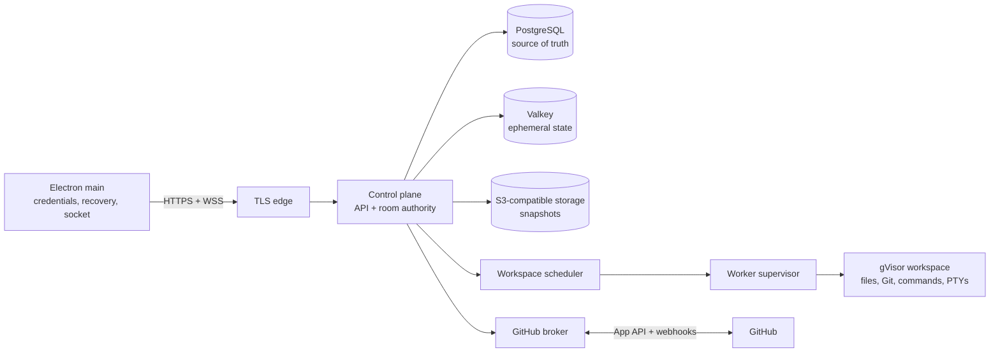

# Cloud collaboration architecture

This document is the recommended next-stage architecture for Trace. It extends the fenced single-writer rules in [COLLABORATION_PROTOCOL.md](./COLLABORATION_PROTOCOL.md); it does not replace them.

The guiding constraint is that the macOS app remains a real desktop IDE. Electron main is the trusted client boundary, the renderer never receives cloud or GitHub credentials, and the current local workspace stays useful when the cloud is unavailable.

## Status and scope

### Implemented in the desktop repository

- Electron, React, Monaco, and xterm provide the desktop shell, editor, and terminal UI.
- Electron main owns local filesystem, Git, GitHub, terminal, and persistence access behind narrow preload bridges.
- The local terminal runs with `node-pty`, has bounded output replay/backpressure, and uses the reusable fenced `ExclusiveControl` primitive.
- GitHub Device Flow keeps user credentials in Electron main and currently supports read-oriented repository, pull request, issue, and review-thread views.
- Durable local annotation storage includes workspace-relative anchors, replies, revisions, idempotent mutation IDs, and an outbox.
- Local editor recovery drafts preserve unsaved work.
- `packages/collaboration-protocol` provides strict versioned room schemas, bounded validators, replay envelopes, and offline queue policy.
- `services/control-plane` provides a standalone Fastify service for workspace identity, HMAC-hashed one-time invites, membership, initial control snapshots, and transactional PostgreSQL persistence.

These are foundations, not deployed cloud collaboration. The control plane now has self-hosted email/password identity, verified accounts, rotating desktop sessions, GitHub OAuth identity linking, GitHub App repository selection, and email/copy-link invitations. There is still no room WebSocket, remote canonical document, sandbox worker, shared remote PTY, or GitHub write-sync service yet. The local `node-pty` process must never be exposed to an invited remote member.

### Future cloud work described here

- Accounts, devices, workspace membership, and expiring invitations.
- A replayable collaboration room with authoritative document versions and fenced control.
- Sandboxed, cloud-hosted Git workspaces and shared terminals.
- Cross-device annotation replay and explicit GitHub publication.
- Workspace sleep/restore, quotas, audit records, monitoring, and incident recovery.

## Recommended stack

Keep the first cloud deployment small and provider-neutral:

| Layer | Recommendation | Reason |
| --- | --- | --- |
| Desktop | Existing Electron + TypeScript + React + Monaco + xterm | Already implemented; Electron main is the correct credential and socket boundary. |
| Control plane | Node.js LTS + TypeScript + Fastify | Shares types and validation concepts with the desktop without introducing a large framework. |
| WebSocket | Fastify WebSocket integration backed by `ws` | Adequate for small rooms; use one protocol and one authentication path. |
| SQL access | PostgreSQL 16+ with a migration tool and a thin typed query layer such as Kysely | PostgreSQL transactions and uniqueness constraints are the source of truth for sequencing and idempotency. |
| Ephemeral state | Valkey | Room routing, presence TTLs, short-lived output buffers, rate limits, and pub/sub; never the sole copy of durable control or edits. |
| Durable blobs | S3-compatible object storage | Encrypted workspace snapshots, document checkpoints, and recovery artifacts without provider lock-in. |
| Sandbox runtime | Dedicated Linux workers using containerd + gVisor (`runsc`) | Safer multi-tenant boundary and better density than ordinary Docker; cheaper for a universal free tier than one microVM per idle workspace. |
| Workspace supervisor | A small Go service on each worker | A compact, static privileged boundary for container lifecycle, PTY attachment, cgroups, and volume management. User commands still run only inside gVisor. |
| Edge/TLS | Caddy or a managed L7 load balancer | TLS termination, WebSocket upgrades, request limits, and simple single-region operations. |
| Telemetry | OpenTelemetry + Prometheus + Grafana + Loki | Open standards and self-hostable components keep operating costs predictable. |
| Infrastructure | OpenTofu/Terraform; Docker Compose for local cloud development | Reproducible deployment without requiring Kubernetes for the MVP. |

Do not start with microservices or Kubernetes. The MVP should have two deployable application binaries:

1. `control-plane`, a modular monolith containing HTTP, room authority, account/invite, scheduler, annotation sync, and GitHub broker modules.
2. `workspace-supervisor`, installed only on dedicated sandbox worker hosts.

Modules can be split after measurements show a real scaling or security need. PostgreSQL, Valkey, and object storage remain replaceable managed or self-hosted dependencies.

## System shape



The renderer calls only the preload bridge. Electron main owns the Trace access token, reconnect state, event cursor, durable outbox, and recovery drafts. It opens the WebSocket with an authorization header and passes normalized events to the renderer.

## Service responsibilities

### Control-plane HTTP API

- Cloud account and device sessions.
- GitHub-first sign-in for the MVP; the cloud issues its own short-lived access token and rotating refresh token.
- Workspace create/open/sleep/delete lifecycle.
- Membership checks and one-time, expiring invite links.
- GitHub App installation selection and repository binding.
- Snapshot download/upload URLs, issued for one workspace and a short time only.

This auth flow is separate from the desktop's current GitHub Device Flow. The desktop must not send its locally stored GitHub user token to the cloud. A browser-based cloud sign-in or device-pairing flow yields Trace session tokens, which Electron main stores using `safeStorage`.

### Room authority

Exactly one control-plane process owns a live room at a time. Room affinity is recorded in Valkey with a TTL, while a PostgreSQL ownership epoch prevents two processes from accepting durable events concurrently.

The room authority:

- serializes durable events;
- allocates monotonically increasing `roomSeq` values;
- performs version, hash, membership, operation-ID, and fence checks;
- owns code and per-terminal `ExclusiveControl` state;
- updates PostgreSQL in a transaction before acknowledging durable mutations;
- dispatches accepted file operations to the workspace supervisor and waits for an idempotent apply result;
- fans normalized events out to connected members.

If the owner dies, another process acquires a higher ownership epoch, restores the latest checkpoint, and replays subsequent PostgreSQL events. A stale owner cannot commit under its old epoch.

### Workspace scheduler

- Places an active workspace on a compatible worker.
- Restores its encrypted volume snapshot and expected Git revision.
- Starts, health-checks, sleeps, and destroys sandboxes.
- Maintains a short lease for the current worker placement.
- Refuses room mutations while restore or integrity verification is incomplete.

The scheduler is a module in the initial control plane. It should become a separate service only when the worker fleet or restore queue needs independent scaling.

### Worker supervisor and sandbox

The trusted supervisor runs on a dedicated Linux host. It may access containerd and only the volumes assigned to that host. User code never runs in the supervisor process.

Each active workspace gets:

- an isolated gVisor sandbox and cgroup;
- a read-only OCI root filesystem plus one writable workspace volume;
- a non-root workload user;
- a bounded process count, CPU, memory, disk, and execution time;
- Git, file watching, command execution, and PTYs inside the sandbox;
- a supervisor channel authenticated to one workspace and one placement epoch.

The control plane sends ordered, idempotent commands such as `document.apply`, `terminal.create`, and `workspace.snapshot`. The supervisor rejects an old placement epoch, duplicate command, stale document version, stale control fence, or path outside the workspace.

Start with one pinned Ubuntu LTS workspace image containing Git, Node.js/TypeScript, Python, a JDK, GCC/Clang for C and C++, SQLite, and PostgreSQL/MySQL command-line clients. HTML and CSS tooling rides with Node.js. Add digest-pinned language packs for Go, Rust, .NET, Ruby, and PHP as usage requires instead of continuously growing one mutable image. Runtime images are independent of Monaco syntax support: the editor may recognize a language even when its compiler is not installed in that workspace. Publish an SBOM and rebuild the images on a regular patch cadence.

### GitHub broker

The cloud broker owns the GitHub App private key in a secret manager or KMS. It mints short-lived installation tokens for the single bound repository. The private key and installation token never enter the renderer, logs, workspace volume, or a terminal environment.

The broker handles:

- repository installation and authorization checks;
- clone/fetch credentials through a short-lived credential helper;
- webhook signature validation and deduplication;
- explicit annotation publication to pull requests or issues;
- persistence of returned GitHub comment/thread IDs before reporting success;
- API caching and rate-limit coordination.

Local-mode GitHub reads may continue through Electron main. A cloud workspace uses the broker for repository access so no desktop GitHub token has to be delegated to a sandbox.

## Durable data model

Use UUIDv7 or another sortable opaque identifier. Never use a local absolute path as a cloud identity.

| Table | Important fields and constraints |
| --- | --- |
| `users` | `id`, profile fields, created/disabled timestamps. |
| `identities` | `user_id`, provider, provider subject; unique `(provider, provider_subject)`. |
| `device_sessions` | device ID, hashed rotating refresh token, expiry, last-used time, revoked time. Never store the raw refresh token. |
| `workspaces` | opaque `room_id`, repository binding, state, ownership epoch, next room sequence, active snapshot, timestamps. |
| `workspace_members` | workspace, user, role (`owner` or `member`), status; unique workspace/user. All invited members may annotate and request control. |
| `workspace_invites` | workspace, token hash, inviter, optional intended identity, expiry, accepted/revoked timestamps. |
| `workspace_placements` | workspace, worker, placement epoch, lease expiry, runtime state. |
| `documents` | workspace, normalized relative path, version, content hash, latest checkpoint reference; unique workspace/path. |
| `room_events` | workspace, `room_seq`, operation ID, actor, type, bounded JSON payload, timestamp; unique workspace/sequence and workspace/operation ID. |
| `control_records` | workspace, resource kind, resource ID, holder, `version`, `fence`, `typing_until`; unique resource. |
| `annotations` | workspace, relative path, UTF-16 range, immutable code revision/hash anchor, status, revision, author and timestamps. |
| `annotation_messages` | annotation, message ID, author, body, timestamps; unique annotation/message ID. |
| `annotation_mutations` | workspace, mutation ID, operation, result fingerprint/result, applied timestamp; unique workspace/mutation ID. |
| `github_publications` | mutation ID, target kind/number, anchor commit, state, GitHub comment/thread IDs, last error and retry time. |
| `workspace_snapshots` | workspace, object key, Git HEAD, document-version manifest hash, size, encryption metadata, created time. |
| `audit_events` | workspace, actor/device, security-relevant action, result, timestamp, trace ID. No source text or terminal input. |

Large source snapshots belong in object storage, not PostgreSQL. PostgreSQL keeps the manifest, hashes, versions, event log, and small annotation bodies. Create a checkpoint after a bounded number or size of edit events, then retain enough events to resume every supported client version. Compaction must not delete events still needed by an active recovery base.

PostgreSQL is authoritative for durable control, edits, annotations, membership, and idempotency. Valkey may cache those records, but losing Valkey must cause reconnection and presence loss—not source loss or two accepted writers.

## Collaboration event protocol

Use one versioned WebSocket protocol between Electron main and the room authority. Start with bounded JSON control frames and binary frames for terminal bytes. A later binary encoding is an optimization, not an architectural change.

### Connection and resume

Electron main connects with:

```json
{
  "v": 1,
  "kind": "hello",
  "roomId": "opaque-room-id",
  "clientId": "stable-device-window-id",
  "resumeAfter": 4821
}
```

The access token is in the WebSocket authorization header, not the payload. The server responds with the current room sequence, minimum replayable sequence, membership, control records, and either replay events or `snapshotRequired: true`.

### Durable command envelope

```json
{
  "v": 1,
  "kind": "command",
  "type": "document.apply",
  "operationId": "client-generated-idempotency-id",
  "requestId": "request-correlation-id",
  "roomId": "opaque-room-id",
  "lastSeenRoomSeq": 4821,
  "payload": {}
}
```

`document.apply` additionally carries:

- normalized workspace-relative path;
- code `controlFence` and `expectedControlVersion`;
- `baseDocumentVersion` and `baseContentHash`;
- bounded UTF-16 edits;
- an optional resulting content hash for integrity verification.

The server produces one of:

- `ack`: operation ID, resulting `roomSeq`, resource version, and content hash;
- `event`: a durable room event with `roomSeq`;
- `reject`: stable error code plus the current control/document version needed to recover.

Useful stable reject codes include `NOT_A_MEMBER`, `CONTROL_BUSY`, `NOT_CONTROL_OWNER`, `STALE_FENCE`, `CONTROL_CHANGED`, `DOCUMENT_CHANGED`, `DUPLICATE_MISMATCH`, `SNAPSHOT_REQUIRED`, `INVALID_PATH`, `PAYLOAD_TOO_LARGE`, and `RATE_LIMITED`.

### Ordering classes

Not every high-volume signal belongs in `room_events`:

| Class | Ordering and durability |
| --- | --- |
| Documents, control changes, annotations, workspace lifecycle | Durable workspace `roomSeq`; replay from PostgreSQL. |
| Presence, cursor location, current viewed file | Ephemeral generation and TTL in Valkey; discard on disconnect. |
| Terminal output | Per-terminal monotonically increasing `outputSeq`; bounded replay buffer with TTL. |
| Terminal input | Live only; validate the terminal fence and never queue or replay. |

A client applies durable events only in `roomSeq` order. A gap triggers replay; a gap older than retention triggers a fresh snapshot. Duplicate operation IDs return the original outcome if the payload fingerprint matches and are rejected if it differs.

## Single-writer behavior

Code control and every terminal have separate control records. Any active invited member may request control.

1. `control.request` includes the observed control version.
2. The authority rejects the request unless the resource's `typingCount` is zero and its 900 ms idle deadline has expired.
3. If idle, a compare-and-swap chooses exactly one requester.
4. Every ownership change increments both `version` and `fence`.
5. Every code edit or terminal input includes the current fence.
6. The room authority and workspace supervisor both reject a stale fence.

The second check at the worker boundary prevents delayed internal messages from an old room owner from changing files or writing to a PTY. Non-writers remain able to browse, select, copy, inspect Git, and create annotations.

The server acknowledges a code edit only after the event is committed and the assigned supervisor confirms idempotent application to the workspace filesystem. A committed event that was not applied because of a crash is replayed to the restored sandbox before new commands are accepted.

## Files, Git, and snapshots

The live sandbox volume is the working tree. The room authority remains the collaboration source of truth through document versions, hashes, and events.

- File edits flow through ordered `document.apply` commands, not arbitrary shared filesystem writes.
- The supervisor watches the tree for changes made by approved terminal commands. An external change invalidates affected document versions, computes new hashes, and emits a resync event; clients never continue editing against the old base silently.
- UI-triggered branch checkout, merge, commit, and reset operations require code control and no active typing. They run through one per-workspace Git mutation queue.
- Users can still run Git in a terminal; the watcher detects HEAD/index/worktree changes and forces the same resync boundary. The product should not claim transactional safety for simultaneous manual Git commands.
- Snapshots include the working tree, Git metadata needed for recovery, Git HEAD, and a signed document-version manifest.
- A sandbox sleeps only after pending edits and annotation mutations are durable and a verified snapshot exists.

Repository credentials are supplied by a short-lived Git credential helper or broker socket and are erased after the operation. They are never written to `.git/config` or exposed as general terminal environment variables.

## Shared terminals

The current local macOS terminal remains private. A shared terminal exists only as a PTY attached to a process inside the cloud sandbox.

- `terminal.create` is an ordered workspace command and returns a terminal ID plus its own control record.
- Input includes terminal ID, `controlFence`, and input sequence. It is rejected unless the sender holds current terminal control.
- Input is never put in PostgreSQL, an offline outbox, or automatic retry logic.
- Output receives `outputSeq` numbers and is retained in a bounded in-memory/Valkey ring buffer. The existing high/low-water backpressure model should be preserved.
- A reconnect resumes after the last acknowledged `outputSeq`; if it has fallen behind the buffer, the server emits `terminal.output-gap` rather than inventing missing output.
- Terminal scrollback is not durably logged by default. Closing or sleeping a workspace terminates PTYs after a short, visible grace period.

## Offline recovery and annotation outbox

Electron main, not the renderer, should ultimately own all cloud recovery persistence.

### Code edits

When connectivity is lost, the app stops claiming canonical writer ownership. The editor may continue in an explicitly labeled local recovery mode:

- preserve base room sequence, base document version/hash, base content, and recovered content;
- never queue terminal input or control requests;
- do not upload recovery content to a different workspace identity;
- encrypt sensitive recovery metadata where practical and protect files with user-only permissions.

On reconnect:

1. Fetch the authoritative document and current control state.
2. If the base still matches, acquire control and submit a bounded diff with the new fence.
3. If it does not match, open a three-way recovery view: base, cloud, and local recovery.
4. Upload only the user's explicit merged result after acquiring control.

Never silently use last-write-wins.

### Annotations

Annotation creation and replies are safe to queue because every mutation has a stable mutation ID. Electron persists an outbox entry before presenting it as saved.

- Replay entries in sequence after membership and workspace identity are revalidated.
- The server stores mutation ID plus payload fingerprint and returns the original result for an exact retry.
- Resolve/reopen includes the expected annotation revision; a mismatch becomes a visible conflict rather than an overwrite.
- Acknowledgement removes only the exact mutation IDs durably accepted by the server.
- Private annotations never publish to GitHub automatically.

## GitHub integration boundaries

GitHub publication is opt-in and limited to a pull request or issue, matching the product contract.

- A pull-request code annotation may become an inline review comment only when repository, PR head commit, side, and line range still match an immutable anchor.
- If the anchor is outdated, offer a normal PR conversation comment or keep it private; never attach feedback to a guessed line.
- An issue-linked annotation becomes a normal issue comment. Trace keeps the private file/range anchor because GitHub issues do not have code-line anchors.
- Publication uses its own idempotency record. Store the returned GitHub comment/thread ID in the same database transaction that marks publication successful before acknowledging the desktop.
- Replies and resolution are synchronized only after explicit user action and only when the GitHub App installation has the required write permission.
- Webhooks update cached PR/issue/thread state after HMAC verification, delivery-ID deduplication, repository-binding checks, and membership checks.

The first release can retain read-only GitHub permissions. Enabling publication is a separate migration requiring updated GitHub App permissions and installation approval.

## Security model

### Client and tenant boundary

- TLS for every external connection and mTLS or short-lived workload identity between internal services.
- Short-lived Trace access tokens; hashed, rotating refresh tokens; per-device revocation.
- Membership and workspace binding checked on every HTTP request, WebSocket command, replay, snapshot URL, and webhook-derived action.
- Opaque room IDs in the cloud; local absolute paths never leave Electron main.
- Strict frame, edit count, text, path, annotation, and rate limits enforced before allocation or persistence.
- Preload allowlists remain narrow; renderer content is not trusted with credentials.

### Sandbox boundary

- Never use ordinary Docker alone as the multi-tenant security boundary.
- gVisor, cgroups v2, seccomp, read-only root filesystem, non-root execution, PID limits, and no privileged containers, host mounts, host PID namespace, devices, or container runtime socket.
- Default-deny access to cloud metadata, link-local, loopback-to-host, and private networks. Permit package downloads through a metered egress proxy that blocks SSRF destinations and records only destination metadata.
- Per-workspace disk encryption and object-store server-side encryption; KMS-backed envelope keys where available.
- Scan OCI images and keep language/toolchain images immutable and reproducible.
- Secrets are short-lived broker capabilities, never shell history, source files, snapshots, or broad environment variables.
- Workspace deletion revokes sessions and credentials, destroys the volume, and queues object deletion according to a published retention period.

For stronger isolation later, the supervisor contract can launch Firecracker microVMs without changing the desktop or event protocol. That should follow threat testing and utilization data rather than precede the MVP.

## Scaling and free-user economics

The app can be free to every user, but compute is not free to operate. The design controls cost without placing collaboration behind a paid feature:

- One initial region, room affinity, and pooled sandbox workers.
- Scale active workspaces, not user accounts; presence-only members are inexpensive.
- Sleep a workspace after approximately 15 minutes with no connected member, running task, or pending durable operation. Make the countdown visible.
- Snapshot once, terminate all PTYs, then release CPU/RAM. Restore on the next open.
- Start with a recommended per-active-workspace ceiling around 2 vCPU, 4 GiB RAM, 5 GiB persistent workspace storage, and two live terminals. Treat these as safety defaults that can be tuned from real usage, not protocol constants.
- Cache layered OCI toolchains and Git objects on workers without allowing cross-tenant writable data.
- Cache GitHub reads under ETags and coordinate rate-limit budgets in Valkey.
- Cap replay windows, terminal buffers, annotation counts, and outbox sizes; return explicit limits rather than dropping data.
- Use S3 lifecycle policies for superseded snapshots and cold audit retention.

For small teams, one room process can serialize a room cheaply. Scale gateways horizontally by consistent room affinity. Scale supervisors by available CPU/RAM/disk. Add regions only after snapshot placement and repository latency justify the operational complexity.

## Reliability and observability

- Instrument desktop-to-room, room-to-database, and room-to-supervisor paths with OpenTelemetry trace IDs.
- Record structured, redacted logs. Never log source bodies, annotation bodies, terminal input/output, access tokens, invite tokens, or signed snapshot URLs.
- Core metrics: connected rooms, resume success, replay depth, edit acknowledgement latency, control conflicts, stale-fence rejects, worker placement time, restore time, PTY buffer pressure, annotation outbox age, GitHub rate-limit remaining, snapshot verification failures, and sandbox kills by limit.
- Alert on two room owners for one epoch, document hash divergence, durable-but-unapplied events, repeated snapshot verification failure, webhook signature failure spikes, and refresh-token reuse.
- Audit invite lifecycle, membership changes, control transfers, GitHub publications, workspace start/sleep/delete, and administrative access—without source or terminal content.
- Enable PostgreSQL point-in-time recovery, object versioning where affordable, daily encrypted backups, and regular restore drills.

Useful initial service targets are p95 edit acknowledgement below 200 ms within the deployment region, successful room resume without a snapshot when the cursor is retained, and a warm workspace restore below 30 seconds. Measure before tightening these targets.

## MVP delivery phases

### Phase 0 — local product foundation (implemented)

- Keep local editing, local Git, local terminal, GitHub reads, drafts, annotations, and control primitives stable.
- Keep renderer-to-main integration and macOS packaging independently releasable from cloud work.
- Use the implemented transport-neutral protocol package as the conformance boundary for the later desktop socket and room authority.

### Phase 1 — accounts, invites, and cloud workspace lifecycle

- GitHub-first Trace account/device pairing.
- Workspace membership and one-time invite links.
- GitHub App installation binding.
- Single-region control plane, worker supervisor, repository clone, sleep, snapshot, and restore.
- One user can open the same cloud workspace from two devices, but only one active editor is enabled until Phase 2.

Exit condition: a workspace can be provisioned, restored on another device, and deleted without credentials or local absolute paths crossing their boundaries.

### Phase 2 — canonical file collaboration

- Room WebSocket, resume/replay, presence, durable events, checkpoints, and control CAS.
- Fenced UTF-16 edit application and stale-fence rejection at both room and worker.
- Read-only non-writer editor state and visible 900 ms handoff behavior.
- Recovery draft upload and three-way conflict UI.

Exit condition: fault-injection tests cannot produce two accepted writers or silent lost edits across reconnect, process crash, and delayed-message scenarios.

### Phase 3 — shared cloud terminals and Git UX

- Per-terminal control, live-only input, output replay, and backpressure.
- Cloud Git status/branches/history/commit/merge operations through the agent.
- External working-tree change detection for terminal-driven edits and Git commands.

Exit condition: no remote member can reach a local Mac PTY, and old terminal fences cannot write after handoff.

### Phase 4 — cloud annotations and GitHub publication

- Annotation outbox replay, revision conflicts, cross-device threads, and resolution.
- Explicit PR inline comments and issue comments through the GitHub broker.
- Webhook reconciliation, delivery deduplication, and durable external IDs.

Exit condition: repeated retries create exactly one cloud mutation and at most one GitHub publication.

### Phase 5 — operational hardening

- Multi-instance room failover, load and soak tests, backup restore exercises, abuse controls, image scanning, dependency patching, and sandbox escape testing.
- Capacity-driven worker autoscaling and optional second region.
- Evaluate Firecracker only if the measured risk or tenancy model requires a stronger boundary.

## Decisions intentionally deferred

- CRDT/OT multi-writer editing. It conflicts with the chosen product contract and is unnecessary for the first release.
- Exposing local terminals remotely. This is prohibited by the trust boundary.
- Automatic publication of private annotations to GitHub.
- Kubernetes, Kafka, and a large service split before measured load requires them.
- A paid-only collaboration tier. Resource guardrails and workspace sleep are the recommended first tools for keeping collaboration free to users.
